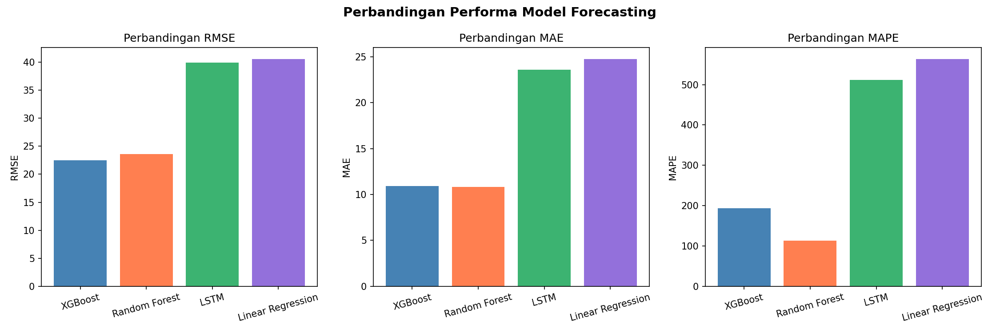
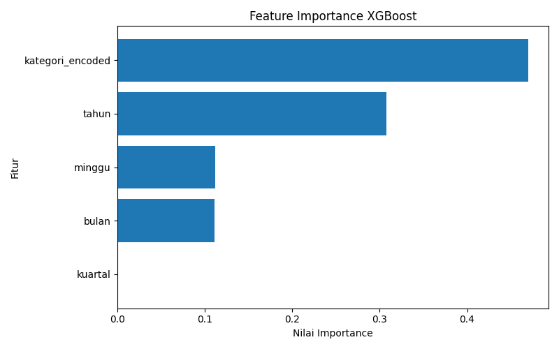
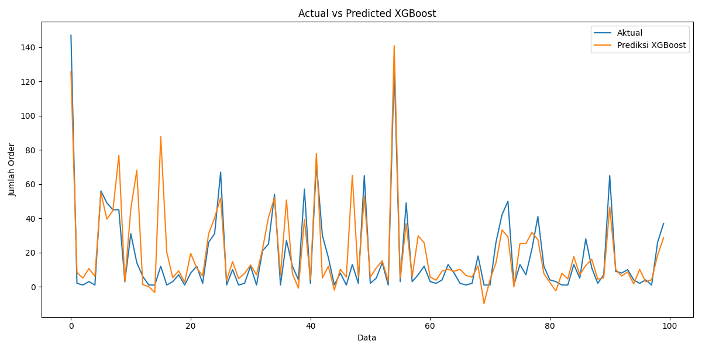
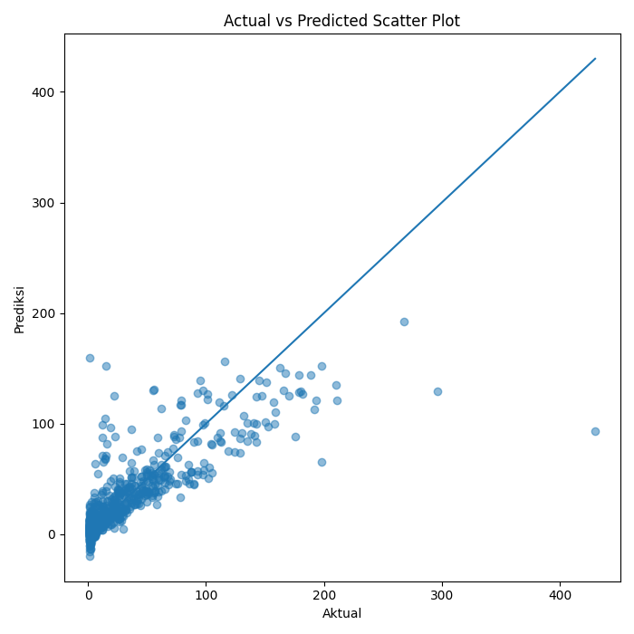
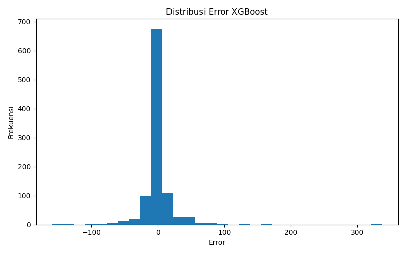

## Prediksi Permintaan Produk E-commerce

Project ini merupakan implementasi Machine Learning untuk memprediksi permintaan produk pada e-commerce menggunakan pendekatan data historis penjualan. Tujuan utama dari project ini adalah untuk membantu analisis pola permintaan dan mendukung pengambilan keputusan bisnis.

## Deskripsi Project

Sistem ini melakukan analisis dan prediksi permintaan produk berdasarkan dataset penjualan e-commerce. Model machine learning digunakan untuk mempelajari pola data historis sehingga dapat menghasilkan prediksi permintaan di masa mendatang.

## Metode yang Digunakan

- Data Preprocessing
- Exploratory Data Analysis (EDA)
- Feature Engineering
- Model Machine Learning (Linear Regression, Random Forest, LSTM, XGBoost)
- Evaluasi Model

## Struktur Folder

data/ -> Dataset yang digunakan

notebooks/ -> File Jupyter Notebook (EDA, training model)

results/ -> Hasil prediksi dan evaluasi model

## Teknologi yang Digunakan

- Python
- Jupyter Notebook
- Pandas
- NumPy
- Scikit-learn
- Torch
- Matplotlib / Seaborn

## Cara Menjalankan Project

1. Clone repository ini
(git clone https://github.com/HoneysuckleClover/prediksi-permintaan-produk.git)

2. Masuk ke folder project
(cd prediksi-permintaan-produk)

4. Install dependencies
(pip install -r requirements.txt)

6. Jalankan notebook atau script Python
(jupyter notebook)

## Hasil Evaluasi Model

1. Perbandingan RMSE, MAE, dan MAPE

2. Feature Importance XGBoost

3. Actual vs Predicted

4. Scatter Plot Prediksi

5. Distribusi Error

